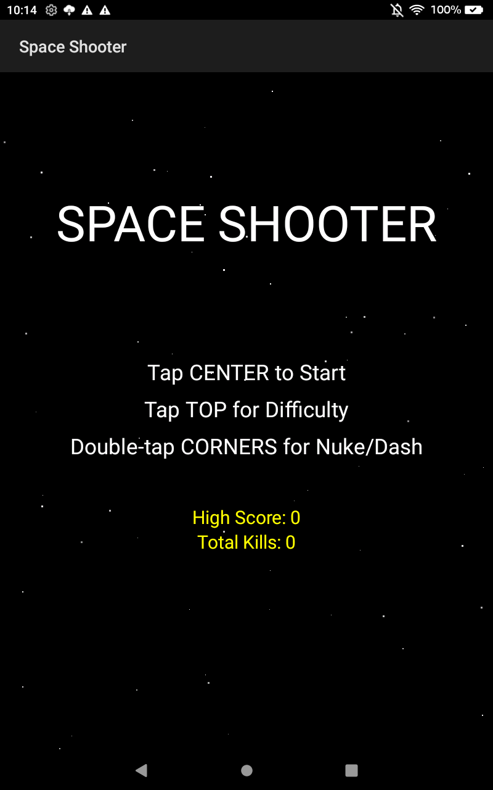

# Space Shooter - Android Arcade Game

A feature-rich space shooter game for Android with boss battles, power-ups, achievements, and multiple game modes.



## Features

### Gameplay
- **10 Levels** with increasing difficulty
- **Boss Battles** at the end of each level
- **Combo System** - Chain kills for score multipliers (up to 8x)
- **Achievements** - Unlock achievements as you play
- **High Score** persistence
- **Lives System** - 3 lives with respawn invincibility

### Enemy Types (7 varieties)
| Enemy | Behavior | Points |
|-------|----------|--------|
| Scout | Fast zigzag movement | 100 |
| Fighter | Standard shooter | 200 |
| Tank | High HP, slow | 300 |
| Bomber | Circular movement pattern | 250 |
| Chaser | Tracks player position | 250 |
| Splitter | Splits when damaged | 400 |
| Healer | Regenerates health | 350 |

### Boss Mechanics
- **3 Phases** with increasing difficulty
- **Phase 2+**: Spawns orbiting minions
- **Phase 3**: Laser beam attack
- **Enrage Mode**: Triggers at 10% health with double attacks

### Power-Ups (7 types)
| Power-Up | Effect | Color |
|----------|--------|-------|
| Health+ | Restore 30 HP | Green |
| Multi-Shot | +1 projectile | Cyan |
| Shield x3 | 3-hit damage shield | Blue |
| Bomb | Clear all enemies | Yellow |
| Rapid Fire | Faster shooting | Magenta |
| Laser | Continuous beam weapon | Pink |
| Nuke | Screen-clearing explosion | Orange |

### Weapons (5 types)
- **Normal** - Standard shot
- **Spread** - Multi-directional fire
- **Laser** - Continuous beam
- **Homing** - Missiles that track enemies
- **Plasma** - Large splash damage orbs

### Special Features
- **Meteor Hazards** - Falling asteroids to dodge/destroy
- **Enemy Formations** - Coordinated wave attacks
- **Boss Minions** - Orbiting enemies that shoot
- **Screen Shake & Flash** - Visual feedback
- **Difficulty Modes** - Easy, Normal, Hard, Extreme

## Controls

| Action | Control |
|--------|---------|
| Move | Touch and drag |
| Shoot | Automatic (when touching) |
| Dash | Double-tap quickly |
| Launch Nuke | Double-tap top-right corner |
| Start Game | Tap center of menu |
| Select Difficulty | Tap top of menu |

## Dash Mechanic
- Double-tap quickly to perform a quick dash
- 1-second cooldown between dashes
- Visual stretch effect and particle trail
- Great for dodging boss attacks and bullets

## Achievements
- First Blood - Get your first kill
- Getting Started - 10 kills
- Massacre - 50 kills
- Century - 100 kills
- Scoring - 1000 points
- High Scorer - 10000 points
- Veteran - Reach level 5
- Master - Complete all 10 levels
- Combo King - 4x combo
- Combo Legend - 8x combo
- Survivor - Survive boss phase 3
- Enrage Survivor - Survive boss enrage
- Champion - Complete the game
- Nuke It! - Use a nuke
- Perfect Start - 20 kills with full lives

## Installation

```bash
# Build the debug APK
./gradlew assembleDebug

# Install on connected device
adb install -r app/build/outputs/apk/debug/app-debug.apk

# Launch the game
adb shell am start -n com.spaceshooter/.MainActivity
```

## Project Structure

```
SpaceShooter/
├── app/src/main/java/com/spaceshooter/
│   ├── MainActivity.java       # Entry point
│   ├── GameSurfaceView.java    # Main game logic
│   ├── PlayerShip.java         # Player ship with weapons
│   ├── Enemy.java             # Base enemy + subtypes
│   ├── Boss.java              # Boss with phases
│   ├── Bullet.java            # Bullet projectile
│   ├── HomingBullet.java      # Homing missile
│   ├── PlasmaBullet.java       # Plasma projectile
│   ├── LaserBeam.java         # Laser weapon
│   ├── PowerUp.java           # Collectible power-ups
│   ├── Particle.java          # Visual particles
│   ├── Star.java              # Background star
│   ├── Meteor.java            # Falling meteor hazard
│   ├── Nuke.java              # Nuke projectile
│   └── BossMinion.java        # Boss summoned minions
└── screenshots/               # Game screenshots
```

## Technical Details

- **Min SDK**: 24 (Android 7.0)
- **Target SDK**: 34 (Android 14)
- **Language**: Java
- **Rendering**: Canvas/SurfaceView
- **Storage**: SharedPreferences (high scores, achievements)

## Screenshots

### Menu Screen


### Gameplay


### Boss Battle


## License

This game is provided as-is for educational and personal use.

## Changelog

### v1.4
- Added dash mechanic
- Added weapon switching system
- Added 5 weapon types
- Added multi-hit shield system
- Added difficulty modes
- Added boss enrage mode
- Added lives system

### v1.3
- Added meteors hazard
- Added nuke weapon
- Added enemy formations
- Added boss minions
- Added pause/resume

### v1.2
- Added achievements system
- Added screen flash effects
- Enhanced boss phases
- Added healer enemy type
- Added splitter enemy type

### v1.1
- Added combo system
- Added screen shake
- Added wave announcements
- Added 5 enemy types
- Extended to 10 levels

### v1.0
- Initial release
- Basic gameplay
- 5 levels with boss
- 4 power-up types
